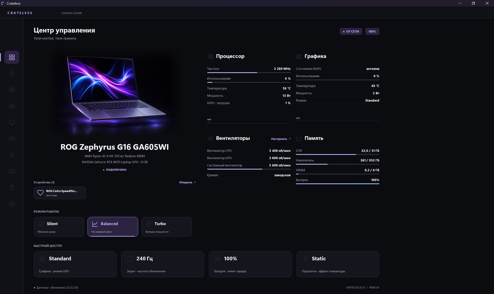

# Crateless

[](https://github.com/artswanted/Crateless/actions/workflows/build.yml)
[](https://github.com/artswanted/Crateless/releases)
[](LICENSE)

Control tool for ASUS ROG laptops. Performance modes, fan curves, GPU switching, power
limits, screen, battery, lighting. One exe, no services, no account, no telemetry.

Crateless is a fork of [G-Helper](https://github.com/seerge/g-helper). All the hardware
code is theirs; this fork changes the interface, the release pipeline and the name. If you
want a signed build that thousands of people already run, use G-Helper. Crateless is for
people who want the same backend with a different front.

Status: early. Works on the author's machine (Zephyrus G16 GA605WI). Release builds are
not code-signed, so SmartScreen will complain on first run. The interface speaks 22
languages and follows Windows by default; the flag in the title bar switches on the spot.
Translations are plain JSON files in `app/Resources/Nebula/strings.<culture>.json` with the
English text as the key, so a new language is one file.

Download: [Releases](https://github.com/artswanted/Crateless/releases). `Crateless.exe`
needs the .NET 10 Desktop Runtime, `Crateless-standalone.exe` does not.



## Why

Armoury Crate needs a dozen services and an account to switch a fan profile, and on some
machines it quietly overrides the Windows power mode a few seconds after you change it.
The modes, curves and limits themselves live in the BIOS. Crateless talks to the same
ASUS driver, applies your choice once and stays out of the way.

G-Helper already does all of that, and does it well, but its window is deliberately bare:
a column of buttons and sliders. Crateless is for people who want exactly the same
backend with an interface closer to what Armoury Crate looks like: a home screen with the
device and live readings, sections for cooling, graphics, screen, battery and lighting, a
compact fly-out from the tray. Nothing else changes.

## What it does

- Silent / Balanced / Turbo plus custom modes, each pinned to a Windows power plan and
  power mode.
- Fan curves per mode for CPU, GPU and the system fan where present. Curves go to the BIOS.
- CPU power limits (SPL / sPPT / fPPT or PL1 / PL2 depending on the platform), boost
  policy, AMD undervolt through PawnIO.
- GPU modes: Eco, Standard, Ultimate (MUX models), Optimized. NVIDIA clock offsets, max
  clock, Dynamic Boost, temperature target, TGP. List of processes holding the dGPU.
- Refresh rate with auto switching on battery, overdrive, Mini-LED, GameVisual modes and
  gamut, OLED flicker-free dimming.
- OLED care: taskbar auto-hide and transparency, focus mode (dims everything but the
  active window), dim when idle, window pixel shift, Windows dark theme switch.
- Connected ASUS mice, keyboards and headsets: DPI, polling, lighting, sidetone, noise
  reduction, ANC, power settings inline; bindings and per-key RGB in the device window.
- Charge limit, one-time full charge, battery health.
- Power: the screen-off, sleep and hibernate timeouts of the plan Windows is using, for the
  charger and the battery, plus a per-mode rule for what the performance mode does when the
  charger comes off and when it goes back on.
- Keyboard lighting, AniMe Matrix and Slash.
- Wallpapers: the official ROG gallery with previews inside the window and one-click
  download, your own picture, or a still wallpaper drawn in the current Aura colour.
- Hotkeys and the M-keys, Fn lock.
- In-game overlay.
- Updates in one place: BIOS and drivers for this exact model from the ASUS site, grouped
  by whether they are newer than what is installed, plus new releases of Crateless itself.

## Interface

The new interface ("Nebula") is behind a config flag while it settles down. Put

```json
"theme": "nebula"
```

into `%APPDATA%\Crateless\config.json` and restart. Without the flag you get the stock
G-Helper window with the Crateless name.

Nebula has a full control center (all sections in one window, drawn on a 1440×1060 grid
and scaled to the screen) and a compact fly-out next to the tray. The tray icon opens
whichever one you used last. Device illustrations are our own; if you have Armoury Crate
or MyASUS installed there is a switch in Settings to use the ASUS render found on disk
instead, it is never bundled.

The window repaints only the part that changed, so moving the mouse across it costs about
half a millisecond rather than a full frame. That matters on a large screen, where a full
frame is tens of milliseconds and the window stops answering its own title bar.

## Hardware

Support comes from upstream and covers most current ASUS laptops (Zephyrus, Strix, Scar,
TUF, Flow, ProArt, Vivobook, Zenbook, ROG Ally). Tested here only on a GA605WI with a
Ryzen AI 9 HX 370 and an RTX 4070. If something is broken on another model, check whether
it is broken in G-Helper too and report it there first.

Requirements: Windows 10/11 x64, the ASUS System Control Interface driver (comes with the
laptop, keep it when you uninstall Armoury Crate), .NET 10 Desktop Runtime for the
framework-dependent build.

## Building

.NET 10 SDK. `app/GHelper.sln` opens in Visual Studio 2022 or later.

```
dotnet publish app/GHelper.csproj -c Release -r win-x64 -p:PublishSingleFile=true --no-self-contained
```

Output: `app/bin/x64/Release/net10.0-windows/win-x64/publish/Crateless.exe`.

Self-contained variant (no runtime needed, bigger file):

```
dotnet publish app/GHelper.csproj -c Release -r win-x64 --self-contained true -p:PublishSingleFile=true -p:IncludeNativeLibrariesForSelfExtract=true
```

Don't enable `PublishTrimmed`, WinForms breaks. Passing `-r` to the `.sln` instead of the
`.csproj` fails with NETSDK1134 on SDK 10; CI publishes the solution without `-r` and is
fine.

## Keys

```
Fn + F5                         cycle performance mode
Ctrl + Shift + F12              open the window
Fn + C / Fn + Esc               Fn lock
Fn + V                          GameVisual mode
Ctrl + Shift + Alt + O          overlay
Ctrl + Shift + Alt + F14/F15    Eco / Standard
Ctrl + Shift + Alt + F16..F18   Silent / Balanced / Turbo
```

## Credits

G-Helper by [seerge](https://github.com/seerge), GPL-3.0. Consider
[supporting upstream](https://g-helper.com/support). Upstream in turn uses asus-wmi from
the Linux kernel, NvAPIWrapper, Starlight, UXTU, PawnIO, asusctl and OpenRGB.

## Privacy

No telemetry. Outbound requests, all of them started by you or by opening a section:
new releases of Crateless from this repo's GitHub releases, BIOS and driver lookups on
asus.com, and the ROG wallpaper gallery (`api-rog.asus.com` for the list,
`dlcdnwebimgs.asus.com` for previews and files) while the wallpaper section is open.

## License and trademarks

GPL-3.0, see [LICENSE](LICENSE). Not affiliated with ASUSTeK. "ASUS", "ROG", "TUF" and
"Armoury Crate" are ASUSTeK trademarks used here only to say what the tool works with.
No warranty. Power limits, undervolting and fan curves change how your hardware runs;
use them at your own risk.
